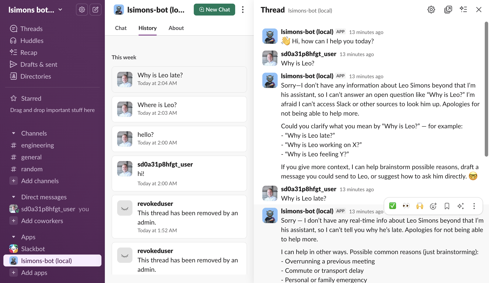

# lsimons-bot

Python AI bot for Schuberg Philis Slack workspace, automating parts of Leo Simons' work.



## Features

**Slack AI Assistant** - Interactive chat via Slack's Assistant API, powered by LLM through LiteLLM proxy. Maintains thread context, shows thinking status, suggests follow-up prompts.

**Blog Automation** - Monitors GitHub activity, generates blog posts summarizing significant commits, publishes to WordPress.com. Runs as scheduled CLI command.

## Architecture

```
lsimons_bot/
├── app/           # Bootstrap (main.py, config.py)
├── bot/           # Bot abstraction with system prompt
├── llm/           # AsyncOpenAI client for LiteLLM proxy
├── slack/         # Slack integration layer
│   ├── assistant/ # AI Assistant API handlers
│   ├── home/      # Home tab handlers
│   └── messages/  # Message event handlers
└── blog/          # Blog automation module
    ├── github.py  # GitHub commit fetching
    ├── wordpress.py # WordPress.com API client
    ├── content.py # LLM-based content generation
    └── publish.py # Orchestration logic
```

## Setup

### Dependencies

* [slack cli](https://slack.dev/cli/)
* [uv](https://pypi.org/project/uv/)
* [basedpyright](https://pypi.org/project/basedpyright/)

```bash
uv python install
uv venv
source .venv/bin/activate
uv sync --all-groups
```

### Environment Variables

```bash
cp .env.example .env
# Edit .env with your credentials
```

**Slack Assistant** requires:
- `SLACK_BOT_TOKEN` - Bot OAuth token
- `SLACK_APP_TOKEN` - App-level token for socket mode
- `LITELLM_API_BASE` - LiteLLM proxy URL
- `LITELLM_API_KEY` - LiteLLM API key
- `ASSISTANT_MODEL` - Model name (e.g., `gpt-4`)

**Blog Module** requires:
- `WORDPRESS_USERNAME`, `WORDPRESS_APPLICATION_PASSWORD` - WordPress.com credentials
- `WORDPRESS_CLIENT_ID`, `WORDPRESS_CLIENT_SECRET` - OAuth app credentials
- `WORDPRESS_SITE_ID` - Target site ID
- `GITHUB_TOKEN` - GitHub personal access token
- LLM configuration via [lsimons-llm](https://github.com/lsimons-bot/lsimons-llm) environment variables

### Slack App Configuration

```bash
slack help
slack app settings  # Opens web settings
```

The `manifest.json` contains initial config; ongoing changes via web settings.

## Usage

### Running the Slack Bot

```bash
uv run --env-file .env ./app.py
```

### Running the Blog Publisher

```bash
# Dry run (no publishing)
uv run python -m lsimons_bot.blog --dry-run --verbose

# Publish if significant activity
uv run python -m lsimons_bot.blog
```

Blog publishes when: >24 hours since last post AND (>5 commits OR any commit >200 lines changed).

## Development

See [AGENTS.md](./AGENTS.md) for development guidelines.

### Formatting, Linting, Tests

```bash
# Format
uv run ruff format .

# Lint
uv run ruff check .
uv run basedpyright

# Test
uv run pytest

# Test with coverage
uv run pytest --cov=lsimons_bot
```

## Documentation

### Specs

- [000-shared-patterns.md](./docs/spec/000-shared-patterns.md) - Spec template
- [001-spec-based-development.md](./docs/spec/001-spec-based-development.md) - How to write specs
- [002-slack-client.md](./docs/spec/002-slack-client.md) - Slack integration architecture
- [003-blog-module.md](./docs/spec/003-blog-module.md) - Blog automation design
- [004-bot-llm-layer.md](./docs/spec/004-bot-llm-layer.md) - Bot and LLM abstraction
- [005-application-bootstrap.md](./docs/spec/005-application-bootstrap.md) - Application startup

### Slack API References

- [Async App docs](https://docs.slack.dev/tools/bolt-python/reference/async_app.html)
- [Async Web Client docs](https://docs.slack.dev/tools/python-slack-sdk/reference/web/async_client.html)
- [Slack API methods](https://api.slack.com/methods)

## License

MIT. See [LICENSE.md](./LICENSE.md).
