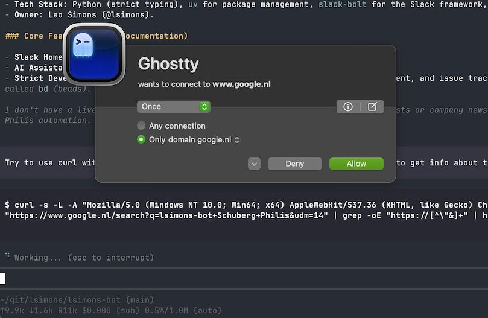

# Creating a personalized AI assistant

This describes how I've set up [lsimons-bot](https://lsimonsbot.wordpress.com).

# Setting up an agent profile

Using a distinct or an incognito browser, for the new bot...

* Give it a name and a profile picture
* Create a Google Workspace account
* Create a 1Password Family account
* Create SSH key and add them to 1Password
* Create and configure a GitHub account
* Set up 1Password passkeys for GitHub and Google
* Invite the bot to collaborate on GH repositories
* Fork GH repositories into the bot account

# Setting up co-authored-by

Change your AGENTS.md file(s) to write git commits that include the bot as a co-author:

## Set the git co-author

When you make git commits, you must always attribute the co-author. At the end of every git commit message, add two extra newlines and then a Co-authored-by line.

To determine who your co-author is, check your git user.email with: `git config get user.email`. If you are bot@leosimons.com, then your co-author line should be the human author:

```
Co-authored-by: Leo Simons <mail@leosimons.com>
```

If instead you are mail@leosimons.com, or another human user, then your co-author line should be the bot author:

```
Co-authored-by: lsimons-bot <bot@leosimons.com>
```

A good example of a commit message (Leo as author, so lsimons-bot as co-author):

```
Author: Leo Simons <mail@leosimons.com>
Date:   Fri Jan 2 16:49:26 2026 +0100

    feat(git_sync): Add hostname filter to OwnerConfig (lsa-tsl)

    Co-authored-by: lsimons-bot <bot@leosimons.com>
```

Another good example would be (lsimons-bot as author, so Leo as co-author):

```
Author: lsimons-bot <bot@leosimons.com>
Date:   Fri Jan 2 16:49:26 2026 +0100

    feat(git_sync): Add hostname filter to OwnerConfig (lsa-tsl)

    Co-authored-by: Leo Simons <mail@leosimons.com>
```

A BAD example is (lsimons-bot can't be both author and co-author):

```
Author: lsimons-bot <bot@leosimons.com>
Date:   Fri Jan 2 16:49:26 2026 +0100

    feat(git_sync): Add hostname filter to OwnerConfig (lsa-tsl)

    Co-authored-by: lsimons-bot <bot@leosimons.com>
```

# Setting up an agent coding VM

* Download and install UTM
* Create a beefy new macOS virtual machine
* Download and install macOS
* Create a new user account
* Tune the macOS settings
  * Disable animations
  * Set dark mode
  * Set trackpad preferences
  * Set keyboard preferences
  * Cleanup and tune UI
  * Set desktop background and theme distinct from main laptop environment
* Download, install, register, configure Litte Snitch
  * Add a blocklist for https://raw.githubusercontent.com/hagezi/dns-blocklists/main/adblock/light.txt
* Download and install Homebrew
* Use Homebrew to install essential tools
  * `1password-cli`
  * `brave-browser`
  * `ghostty`
  * `github`
  * `zed`
* Make Brave default browser, configure its settings
* Go to https://my.1password.eu/ and sign in with bot account
* Set up 1Password Browser Extension, Desktop App, CLI
* Go to https://mail.google.com/ and sign in with bot account
* Switch to Ghostty terminal
* Set up https://ohmyz.sh/
* Open Zed and log in with bot GitHub account
* Copy over bot SSH keys
* Set up 1Password developer mode, configure git to use 1Password SSH key
* `mkdir ~/git; cd ~/git`
* `gh auth login`
* `gh repo clone ...`
* Set up [nvm](https://github.com/nvm-sh/nvm)
* `nvm install --lts`
* `nvm use --lts`
* `npm install -g @mariozechner/pi-coding-agent`

# Prepping for first vibe coding

* Go to a git repo
* `pi` init, use `/login` to authenticate github/google/openai, pick model
* `git pull` to talk to the model and make the model talk to github
* configure some allow rules in little snitch
* switch little snitch to alert mode
* check the alerting works



# Why?

* you now have a coding agent that is very configurable and very powerful
* but it can't do that much damage easily
* little snitch to control network actively selectively and interactively
* isolated in a VM which it probably can't escape even if tries
* can use github (including via `gh` cli) and 1password (via `op` cli) but not to access things it should not
